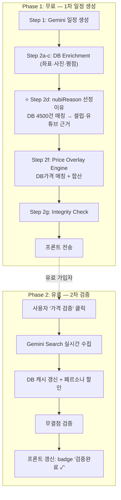

# NUBI 백엔드 워크플로우 — 선정이유 + 가격 파이프라인

> **최종 업데이트:** 2026-02-15
> **상태:** 구현 대기 (계획 완료)
> **선행 조건:** pipeline-v3.ts 정상 작동 중, MCP 2단계 데이터 수집 완료 (4,500건)

> [!CAUTION]
> **Layer 0 (nubiReason 선정이유)이 최우선입니다.** 가격보다 먼저 구현할 것.
> 모든 슬롯에 반드시 구체적 근거("차은우 25년 9월20일 방문", "빠니보틀 '비밀이야' 24년 11월 게시")가 한줄로 들어가야 합니다.

---

## 아키텍처 전체도



---

## 1. 선정이유 (nubiReason) — Layer 0 ⭐

### 1.1 현재 문제

`generateNubiReasonV2()` (pipeline-v3.ts line 992-1152)가 매번 YouTube/Naver를 실시간 검색합니다.
**MCP 2단계에서 수집한 `placeNubiReasons` 테이블 4,500건을 전혀 사용하지 않습니다.**

### 1.2 수정: placeNubiReasons DB 우선 조회

**파일**: `server/services/agents/pipeline-v3.ts`
**위치**: `generateNubiReasonV2()` 함수, line 999 (`try` 블록 시작 직후)

**기존** 1순위: 셀럽 방문 실시간 검색 → 느림, 불안정
**수정 후** Priority 0: `placeNubiReasons` DB 조회 (0ms) → 없으면 기존 fallback

```typescript
// ── 🌟 Priority 0: placeNubiReasons DB (MCP 2단계 수집 데이터) ──
if (db) {
  try {
    let dbPlaceId: number | null = null;
    const placeMatch = await db.select({ id: places.id })
      .from(places)
      .where(ilike(places.name, `%${placeName}%`))
      .limit(1);
    if (placeMatch.length > 0) dbPlaceId = placeMatch[0].id;

    if (dbPlaceId) {
      const [nubiRow] = await db.select({
        nubiReason: placeNubiReasons.nubiReason,
        sourceType: placeNubiReasons.sourceType,
        evidenceUrl: placeNubiReasons.evidenceUrl,
        sourceRank: placeNubiReasons.sourceRank,
      })
        .from(placeNubiReasons)
        .where(eq(placeNubiReasons.placeId, dbPlaceId))
        .orderBy(asc(placeNubiReasons.sourceRank))
        .limit(1);

      if (nubiRow && nubiRow.nubiReason) {
        console.log(`[NubiReason] ✅ DB hit: ${placeName} → ${nubiRow.nubiReason}`);
        return nubiRow.nubiReason;
      }
    }

    // 0b. place_seed_raw fallback (MCP 1단계 데이터)
    const { findCityUnified } = await import('../city-resolver');
    const cityResult = await findCityUnified(cityName);
    if (cityResult) {
      const [seedRow] = await db.select({ nubiReason: placeSeedRaw.nubiReason })
        .from(placeSeedRaw)
        .where(and(
          eq(placeSeedRaw.cityId, cityResult.cityId),
          ilike(placeSeedRaw.nameEn, `%${placeName}%`),
          sql`${placeSeedRaw.nubiReason} IS NOT NULL`,
        ))
        .limit(1);

      if (seedRow && seedRow.nubiReason) {
        return seedRow.nubiReason;
      }
    }
  } catch (e) { /* DB 조회 실패 → 기존 실시간 검색 fallback */ }
}
// 이후 기존 1~6순위 (셀럽→유튜버→네이버→패키지→여행앱→구글리뷰) 유지
```

**import 추가**:
```typescript
import { placeNubiReasons, placeSeedRaw } from '@shared/schema';
import { asc } from 'drizzle-orm';
```

### 1.3 evidenceUrl 전달 (슬롯 메타데이터 확장)

**파일**: `pipeline-v3.ts` line 604 이후에 추가:
```typescript
nubiEvidenceUrl: await getNubiEvidenceUrl(enrichedPlace.name, cityId),
nubiReasonSource: await getNubiSourceType(enrichedPlace.name, cityId),
```

헬퍼 함수 2개는 파일 하단에 추가 (각 ~8줄, `placeNubiReasons` 테이블 조회).

### 1.4 검증 기준
- nubiReason 커버율 ≥ 80% ("데이터 수집 중" 아닌 비율)
- 서버 로그 `[NubiReason] ✅ DB hit` 카운트 추적

---

## 2. 가격 파이프라인 — Layer 1~3

### 2.1 슬롯별 가격 결정 우선순위

```
Priority 1: placePrices DB (source ≠ 'google_places', conf ≥ 0.7, 30일 이내)
Priority 2: Gemini Step 1 estimatedCostEur (> 0 AND < 500)
Priority 3: MEAL_BUDGET fallback (식사 슬롯만)
```

### 2.2 신규 파일: `server/services/price-overlay.ts` (~300줄)

| # | 함수명 | 역할 |
|---|---|---|
| 1 | `applyPriceOverlay(result, formData, eurToKrw)` | 메인 진입점 |
| 2 | `resolveSlotPrice(place, cityId, mealBudget)` | Priority 1→2→3 가격 결정 |
| 3 | `getVerifiedPriceFromDB(placeName, cityId)` | placePrices 조회 (google_places 제외) |
| 4 | `applyPersonaDiscount(price, place, formData)` | 나이·국적 할인 |
| 5 | `getHiddenCosts(cityId, cityName)` | 관광세, 팁, 자리세 |
| 6 | `recalculateDayCost(day, eurToKrw)` | 일일비용 재계산 |
| 7 | `recalculateTotalCost(result, eurToKrw)` | 총비용 재계산 |

### 2.3 pipeline-v3.ts 수정 (3줄 추가 + line 599 수정)

**Step 2f 통합** (line 964 이후):
```typescript
const { applyPriceOverlay } = await import('../price-overlay');
await applyPriceOverlay(result, formData, eurToKrw);
```

**Gemini 식사가격 살리기** (line 599):
- Before: `mealPrice: mealBudget.lunch` (하드코딩)
- After: `mealPrice: s.gPlace.estimatedCostEur > 0 ? s.gPlace.estimatedCostEur : mealBudget.lunch`

### 2.4 신규 DB 테이블 2개

- `city_macro_costs` — 도시별 식비/관광세/팁/자리세
- `city_transport_fares` — 대중교통/택시/공항교통 요금

### 2.5 정적 데이터: `server/data/city-static-costs.json`

ETIAS, 관광세, 페르소나 할인 (Louvre/Orsay 26세 미만 무료 등) 하드코딩.

---

## 3. Phase 2: 실시간 검증 (유료)

### 3.1 신규 파일: `server/services/price-verifier.ts` (~200줄)

| # | 함수명 | 역할 |
|---|---|---|
| 1 | `verifyAllPrices(itinerary, formData)` | 모든 슬롯 검증 |
| 2 | `verifySlotPrice(place, cityName)` | Gemini Search 실시간 검증 |
| 3 | `buildPriceSearchPrompt(...)` | 프롬프트 생성 |
| 4 | `saveVerifiedPrice(...)` | placePrices 캐시 저장 |
| 5 | `runIntegrityCheck(itinerary)` | 무결점 검증 |

### 3.2 API 엔드포인트 2개 (`server/routes.ts`)

- `POST /api/itinerary/:id/verify-prices` — 유료 검증 요청
- `GET /api/itinerary/:id/price-status` — 검증 상태 조회

---

## 구현 체크리스트

```
⭐ 선정이유 (최우선)
□ 1. pipeline-v3.ts generateNubiReasonV2에 placeNubiReasons DB 조회 추가
□ 2. pipeline-v3.ts에 placeNubiReasons, placeSeedRaw import 추가
□ 3. pipeline-v3.ts 슬롯에 nubiEvidenceUrl, nubiReasonSource 필드 추가
□ 4. 파리 일정 생성 → 모든 슬롯 nubiReason 존재 확인 (80%+ 커버율)

인프라
□ 5. shared/schema.ts에 2개 테이블 정의 추가
□ 6. server/data/city-static-costs.json 생성

가격 엔진
□ 7. server/services/price-overlay.ts 작성 (7개 함수)
□ 8. pipeline-v3.ts Step 2f 통합 (3줄 추가)
□ 9. pipeline-v3.ts line 599 식사가격 수정

검증
□ 10. 파리 일정 생성 → 모든 슬롯 priceSource 확인
□ 11. totalCost가 슬롯 합산과 일치 확인

Phase 2 (유료 — Phase 1 완료 후)
□ 12. server/services/price-verifier.ts 작성
□ 13. server/routes.ts에 2개 API 추가
□ 14. Integrity check 로직 완성
```

> **상세 코드 명세**: `implementation_plan.md` (artifact) 참조
