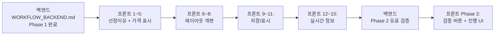

# NUBI 프론트엔드 워크플로우 — UI/UX 전면 개편

> **최종 업데이트:** 2026-02-15
> **상태:** 구현 대기 (계획 완료)
> **선행 조건:** 백엔드 워크플로우 (WORKFLOW_BACKEND.md) Phase 1 완료 후 진행
> **핵심 파일:** `client/screens/TripPlannerScreen.tsx` (83KB, 1,800줄 — 메인 화면)

> [!IMPORTANT]
> 백엔드에서 전달하는 데이터를 프론트에서 제대로 표시하지 않으면 의미가 없습니다.
> 이 문서는 백엔드 완료 후 순차 진행할 프론트엔드 작업 목록입니다.

---

## 현재 문제점 6가지 + 해결 방안

---

### 🔴 이슈 1: 출발지가 파리로 고정됨

**현상**: `TripPlannerScreen.tsx` line 196에 `destination: "Paris"` 하드코딩
**영향**: 전세계 대상 서비스인데 파리만 가능

**해결**:
| 파일 | 수정 |
|---|---|
| `TripPlannerScreen.tsx:196` | `destination: ""` (빈 값) |
| 온보딩 화면 | `PlaceAutocomplete` 컴포넌트로 도시 검색 (이미 존재) |
| 백엔드 | pipeline-v3는 이미 도시명을 파라미터로 받음 — 수정 불필요 |

```typescript
// Before (line 196)
destination: "Paris",

// After
destination: "", // 사용자가 선택해야 진행
```

**검증**: 도쿄, 로마, 바르셀로나로 일정 생성 테스트

---

### 🔴 이슈 2: 모든 슬롯에 가격 표시 (공원/광장 포함)

**현상**: 무료 장소(공원, 광장, 거리)에도 `€0` 또는 의미 없는 가격 표시
**위치**: `TripPlannerScreen.tsx` line 1329-1332

**현재 코드**:
```typescript
: (place as any).estimatedPriceEur > 0 && (place as any).estimatedPriceEur < 500
  ? `🎫 €${(place as any).estimatedPriceEur}`
```

**해결**: 무료 장소는 가격 대신 "무료 입장" 또는 아예 미표시

```typescript
// 수정 후 로직
const priceDisplay = place.isMealSlot
  ? `💰 식사: €${place.mealPrice || '??'}`
  : place.estimatedPriceEur > 0 && place.estimatedPriceEur < 500
    ? `🎫 €${place.estimatedPriceEur}`
    : place.priceSource === 'free'
      ? '✨ 무료 입장'
      : null; // 가격 정보 없으면 미표시
```

**추가 표시** (백엔드 연동 후):
```
⭐ 차은우 25년 9월 방문        ← nubiReason (가장 크게)
📎 출처 보기                   ← evidenceUrl (탭 가능)
💰 €22 · 클룩 확인             ← 가격 + 출처
🏷️ 26세 미만 무료 적용          ← priceNote (할인 안내)
```

**Price Badge (신뢰도 기반)**:
```typescript
function getPriceBadge(confidence: number) {
  if (confidence >= 0.8) return { text: "검증됨 ✓", color: "#27AE60" };
  if (confidence >= 0.5) return { text: "추정가격", color: "#F39C12" };
  return { text: "참고가격", color: "#95A5A6" };
}
```

---

### 🔴 이슈 3: 저장된 일정 전체 보기 불가

**현상**: 프로필에서 저장된 일정 클릭 → `SavedTripDetailScreen.tsx`로 이동하지만 요약 정보(여행 기간, 동행, 바이브) + 영상만 표시. **전체 일정(Day별 장소·시간·가격)**을 볼 수 없음.

**원인**: `SavedTripDetailScreen.tsx`가 `itinerary.days` 데이터를 렌더링하지 않음

**해결**:

| 항목 | 내용 |
|---|---|
| API | `GET /api/itineraries/:id`가 `days[]` + `places[]` 반환하는지 확인 |
| 화면 | `SavedTripDetailScreen.tsx`에 일별 장소 목록 렌더 추가 |
| 재사용 | `TripPlannerScreen.tsx`의 장소카드 렌더 로직을 컴포넌트로 분리 |

**구현 방향**:
```
SavedTripDetailScreen
├── 여행 요약 (기존 유지)
├── 📅 전체 일정 (신규)
│   ├── Day 1: 파리 역사 투어
│   │   ├── 09:00 루브르 박물관 ⭐차은우 25년 9월 방문
│   │   ├── 12:00 Le Bouillon Chartier 💰€15
│   │   └── ...
│   ├── Day 2: ...
│   └── Day N: ...
├── 💰 전체 비용 요약 (신규)
└── 🎬 여행 영상 (기존 유지)
```

**공유 컴포넌트 추출**:
- `PlaceSlotCard.tsx` — 장소 카드 (nubiReason + 가격 + 시간)
- `DaySummaryCard.tsx` — 일일 요약 (식사 + 입장료 + 교통)
- `TripCostSummary.tsx` — 전체 비용

---

### 🟡 이슈 4: 실시간 정보가 프론트에 전달 안됨

**현상**: 백엔드에 위기정보(CrisisAlert), 날씨, 환율 데이터가 있지만 프론트에 부분적으로만 표시

**현재 상태**:
| 데이터 | 백엔드 | 프론트 | 상태 |
|---|---|---|---|
| 위기/파업/시위 | ✅ `crisisAlerts` | ✅ `CrisisAlertBanner` | 동작함 (일부) |
| 날씨 | ✅ pipeline에서 수집 | ❌ 미표시 | 전달만 안됨 |
| 환율 | ✅ `eurToKrw` 계산됨 | ⚠️ 총비용에만 적용 | 슬롯별 미표시 |
| ETIAS | ❌ 미구현 | ❌ | 백엔드 먼저 |

**해결**:

#### 4a. 날씨 표시
```
📅 Day 1 — 파리 역사 투어
☀️ 22°C 맑음 | 습도 45%      ← 일별 날씨 헤더
```

#### 4b. 실시간 환율 슬롯별 적용
```
💰 €22 (₩32,000)              ← 모든 가격에 원화 병기
💱 적용 환율: 1€ = ₩1,456     ← 하단에 환율 정보
```

#### 4c. ETIAS 알림 (백엔드 완료 후)
```
⚠️ ETIAS 비자 | €7/인 (18~70세) | 3년 유효
```

---

### 🟡 이슈 5: 일별 페이지가 탭으로 분리됨

**현상**: `dayTabs`로 Day 1, Day 2... 탭 전환. 전체 여정을 한눈에 볼 수 없음.
**위치**: `TripPlannerScreen.tsx` line 1158-1175 (`dayTabsContainer`)

**사용자 요구**: 길어도 한 페이지로 구현 (스크롤 방식)

**해결**:
```
현재: [Day 1 탭] [Day 2 탭] [Day 3 탭] → 선택한 Day만 표시
수정: 모든 Day를 세로 스크롤로 연속 표시

┌─────────────────────────────┐
│ 📅 Day 1 — 파리 역사 투어    │
│ ├── 09:00 루브르 ...         │
│ ├── 12:00 점심 ...           │
│ └── 15:00 오르세 ...         │
│                              │
│ 📅 Day 2 — 몽마르뜨 산책     │
│ ├── 10:00 Sacré-Cœur ...     │
│ ├── 13:00 점심 ...           │
│ └── 16:00 ...                │
│                              │
│ 📅 Day 3 — ...               │
│ ... (스크롤 계속)             │
└─────────────────────────────┘
```

**구현**:
```typescript
// Before: activeDay state로 탭 전환
const [activeDay, setActiveDay] = useState(0);
// 선택된 Day만 렌더
{itinerary.days[activeDay].places.map(...)}

// After: 모든 Day를 FlatList/ScrollView로 연속 렌더
{itinerary.days.map((day, dayIdx) => (
  <View key={dayIdx}>
    <DayHeader day={day} dayIdx={dayIdx} />
    {day.places.map((place, placeIdx) => (
      <PlaceSlotCard key={placeIdx} place={place} />
    ))}
    <DayCostSummary day={day} />
  </View>
))}
```

> [!TIP]
> Day 탭은 삭제가 아니라 **네비게이션 존** 역할로 전환.
> 탭 클릭 시 해당 Day 섹션으로 `scrollTo()` 이동.

---

### 🟡 이슈 6: 지도 탭 영역 기본값 문제

**현상**: 지도 탭 클릭 시 바로 지도 전체화면 → 무엇을 보여주는지 불분명
**사용자 요구**: 디폴트는 **여정 요약 + 비용 + 실시간 정보**, 지도는 토글 방식

**해결 구조**:
```
┌─────────────────────────────────┐
│  📊 여정 요약 (디폴트 뷰)        │
│                                  │
│  🗓️ 3박 4일 파리                 │
│  👥 2인 커플 · Romantic 바이브   │
│                                  │
│  💰 총 비용                      │
│  ├── 식사   €156 (₩227,000)     │
│  ├── 입장료 €66 (₩96,000)       │
│  ├── 교통   €21 (₩31,000)       │
│  ├── 기타   €15 (₩22,000)       │
│  └── 합계   €258 (₩376,000)/인  │
│                                  │
│  ⚠️ 실시간 정보                  │
│  ├── 💱 환율: 1€ = ₩1,456       │
│  ├── ☀️ 파리 22°C 맑음          │
│  └── ✅ 위기사항 없음             │
│                                  │
│  ┌─────────────────────────┐    │
│  │  🗺️ 지도 보기 (토글)     │    │
│  └─────────────────────────┘    │
│                                  │
│  (토글 클릭 시 지도 펼침)         │
│  ┌─────────────────────────┐    │
│  │       [지도 영역]         │    │
│  │  📍 Day 1 경로 표시       │    │
│  │  📍 Day 2 경로 표시       │    │
│  └─────────────────────────┘    │
└─────────────────────────────────┘
```

---

## 추가 개선사항

| # | 항목 | 우선순위 | 설명 |
|---|---|---|---|
| 7 | nubiReason 크게/진하게 표시 | ⭐ 최우선 | 현재 작은 글씨 — `fontSize: 16`, `fontWeight: 800` |
| 8 | evidenceUrl 링크 연결 | ⭐ 최우선 | 탭하면 인스타/유튜브 근거 열기 |
| 9 | PlaceSlotCard 컴포넌트 분리 | 높음 | TripPlannerScreen 83KB → 핵심 로직 분리 |
| 10 | 비용 비교 차트 (바 차트) | 중간 | 식사/입장료/교통 비율 시각화 |
| 11 | 오프라인 저장 | 중간 | AsyncStorage에 전체 일정 캐시 |
| 12 | PDF 내보내기 | 낮음 | 일정을 PDF로 저장/공유 |

---

## 구현 체크리스트

```
── 최우선 (백엔드 완료 후 즉시) ──
□ 1. destination 하드코딩 제거 ("Paris" → "")
□ 2. PlaceSlotCard 컴포넌트 분리 (nubiReason + 가격 + 시간)
□ 3. nubiReason 크게/진하게 표시 + evidenceUrl 링크
□ 4. 무료 장소 가격 미표시 (priceSource === 'free' → "✨ 무료 입장")
□ 5. Price Badge (검증됨 ✓ / 추정가격 / 참고가격)

── 레이아웃 개편 ──
□ 6. 일별 탭 → 세로 스크롤 한페이지 전환
□ 7. Day 탭을 네비게이션 존으로 전환 (scrollTo)
□ 8. 지도 탭 → 여정요약 디폴트 + 지도 토글

── 저장/표시 ──
□ 9. SavedTripDetailScreen에 전체 일정(days[].places[]) 렌더 추가
□ 10. DaySummaryCard, TripCostSummary 컴포넌트 생성
□ 11. API 확인: GET /api/itineraries/:id → days 데이터 포함 여부

── 실시간 정보 ──
□ 12. 일별 날씨 헤더 추가
□ 13. 슬롯별 원화 병기 (€22 → €22 ₩32,000)
□ 14. 환율 정보 하단 표시
□ 15. ETIAS 알림 배너 (백엔드 신호 수신 후)
```

---

## 작업 순서


