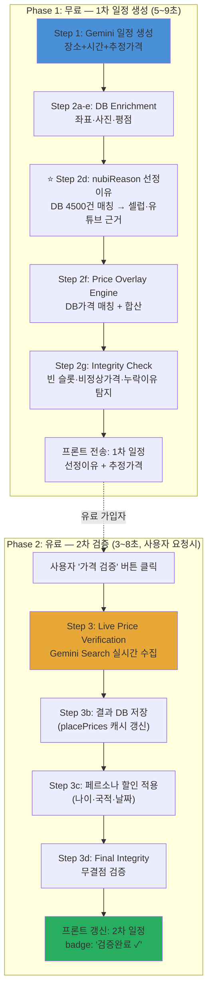

# NUBI 실시간 가격 + 선정이유 파이프라인 — 마스터 워크플로우

> **이 문서는 어떤 AI 에이전트든 이탈 없이 구현할 수 있는 세밀한 명세서입니다.**
> 백엔드·프론트엔드 전 과정을 Step-by-Step으로 정의합니다.

> [!CAUTION]
> **Layer 0 (nubiReason 선정이유)가 가장 중요한 차별포인트입니다.**
> 모든 슬롯에 반드시 구체적 근거(셀럽 방문일, 유튜브 영상 제목·날짜 등)가 한줄 요약으로 들어가야 합니다.
> 예: "차은우 25년 9월20일 방문", "빠니보틀 '비밀이야' 24년 11월 게시"

---

## 1. 아키텍처 전체도



---

## 2. 데이터 흐름 상세

### 2.0 ⭐ 슬롯별 선정이유 (nubiReason) — 최우선 차별포인트

> [!IMPORTANT]
> **모든 장소 슬롯에 반드시 1줄 선정이유가 들어가야 합니다.**
> 가격보다 중요합니다. 이것이 NUBI가 다른 여행앱과 다른 이유입니다.

**nubiReason 결정 우선순위:**

```
┌────────────────────────────────────────────────────────────────┐
│ Priority 0: placeNubiReasons DB (MCP 2단계에서 수집된 4,500건) │
│   테이블: place_nubi_reasons                                   │
│   필드: sourceRank(1~5), sourceType, nubiReason, evidenceUrl   │
│   예: "리사(BLACKPINK) 24년 5월 게시"                          │
│   → evidenceUrl로 출처 즉시 확인 가능                          │
├────────────────────────────────────────────────────────────────┤
│ Priority 0b: place_seed_raw.nubi_reason (1차 시딩 데이터)       │
│   테이블: place_seed_raw                                       │
│   조건: nubi_reason IS NOT NULL                                │
│   → placeNubiReasons에 없으면 여기서 조회                      │
├────────────────────────────────────────────────────────────────┤
│ Priority 1: 셀럽 방문 실시간 검색 (기존 generateNubiReasonV2)   │
│ Priority 2: 유튜버 18인 DB 조회                                │
│ Priority 3: 네이버 블로그 건수                                  │
│ Priority 4: 패키지투어 4사                                      │
│ Priority 5: 여행앱 (마이리얼트립/클룩)                          │
│ Priority 6: 구글 리뷰 수                                       │
│ Fallback: "데이터 수집 중"                                     │
└────────────────────────────────────────────────────────────────┘
```

**nubiReason 예시 (실제 표시 형태):**

| 장소 | nubiReason | sourceType |
|---|---|---|
| Shakespeare and Company | 차은우 25년 9월20일 방문 | instagram |
| Café de Flore | 빠니보틀 '비밀이야' 24년 11월 게시 | youtube |
| Le Bouillon Chartier | 네이버 블로그 890건 | naver_blog |
| Sainte-Chapelle | 하나투어·모두투어 필수코스 | package |
| Pont Alexandre III | 마이리얼트립 4.8점 (320건) | travel_app |

---

### 2.1 슬롯별 가격 결정 우선순위

**모든 장소(슬롯)에 대해 아래 순서로 가격 결정:**

```
┌─────────────────────────────────────────────────────┐
│ Priority 1: placePrices DB (source ≠ 'google_places')│
│   조건: confidence ≥ 0.7 AND fetchedAt < 30일       │
│   예: klook €22, gemini_search €22                  │
│   → priceSource = "klook", priceConfidence = 0.9    │
├─────────────────────────────────────────────────────┤
│ Priority 2: Gemini Step 1 estimatedCostEur           │
│   조건: > 0 AND < 500                               │
│   예: Gemini가 검색으로 추정한 €22                    │
│   → priceSource = "gemini_estimate"                  │
│   → priceConfidence = 0.5                            │
├─────────────────────────────────────────────────────┤
│ Priority 3: MEAL_BUDGET fallback (식사 슬롯만)        │
│   조건: 위 2개 모두 없을 때만                         │
│   예: Reasonable lunch = €21                         │
│   → priceSource = "budget_estimate"                  │
│   → priceConfidence = 0.3                            │
└─────────────────────────────────────────────────────┘
```

### 2.2 합산 구조

```
Slot Level (각 장소)
├── ⭐ nubiReason: "차은우 25년 9월20일 방문"  ← 최우선!
├── nubiReasonSource: "instagram"             ← sourceType
├── nubiEvidenceUrl: "https://..."            ← 근거 링크
├── estimatedPriceEur: 22                     ← 가격
├── priceSource: "klook"                      ← 출처
├── priceConfidence: 0.9                      ← 신뢰도
├── priceFetchedAt: "2026-02-15"              ← 수집일
├── priceNote: null                           ← 할인 적용시
├── mealPrice: 21                             ← 식사 슬롯만
└── mealPriceSource: "gemini_estimate"
         ↓ 합산
Day Level (일별)
├── dailyCost.perPersonEur: 71.20
├── dailyCost.breakdown:
│   ├── mealEur: 39
│   ├── entranceEur: 22
│   ├── transportEur: 5.20
│   └── hiddenCostEur: 5.00
└── nubiReasonCoverage: 5/6 (83%)  ← 선정이유 커버율
         ↓ 합산
Trip Level (전체)
├── totalCost.perPersonEur: 213.60
├── totalCost.perPersonKrw: 312,000
├── budget.totals: { meals, entranceFees, transport, hiddenCosts }
├── nubiReasonCoverage: 14/15 (93%)  ← 전체 커버율
└── priceVerification:
    ├── status: "estimated" | "verified"
    ├── verifiedSlots: 8 / 15
    └── verifiedAt: null | "2026-02-15T19:30:00"
```

---

## 3. 백엔드 구현 명세

### Phase 1: 1차 일정 (무료)

---

#### 3.0 ⭐ [MODIFY] `pipeline-v3.ts` — nubiReason DB 우선 조회 추가

> **이것이 가장 중요한 변경입니다. 가격보다 먼저 구현할 것.**
>
> **현재 문제**: `generateNubiReasonV2()` (line 992-1152)는 매번 YouTube/Naver/Google을 실시간 검색합니다.
> 하지만 MCP 2단계에서 이미 수집한 `placeNubiReasons` 테이블 데이터(4,500건)를 **전혀 사용하지 않습니다.**

**위치**: `generateNubiReasonV2()` 함수의 맨 위 (line 999, `try` 블록 시작 직후)

**Before (line 998-1004):**
```typescript
  try {
    // ── 1순위: 셀럽 방문 흔적 ──
    if (celebrityVisit && celebrityVisit.found) {
      const group = celebrityVisit.celebrityGroup ? `(${celebrityVisit.celebrityGroup})` : '';
      return `${celebrityVisit.celebrityName}${group} ${celebrityVisit.date} 게시`;
    }
```

**After:**
```typescript
  try {
    // ── 🌟 Priority 0: placeNubiReasons DB (MCP 2단계 수집 데이터) ──
    // 4,500건의 사전 수집된 선정이유 — 가장 신뢰도 높고 구체적
    if (db) {
      try {
        // 0a. placeNubiReasons 테이블 조회 (sourceRank 낮을수록 신뢰도 높음)
        let dbPlaceId: number | null = null;
        const placeMatch = await db.select({ id: places.id })
          .from(places)
          .where(ilike(places.name, `%${placeName}%`))
          .limit(1);
        if (placeMatch.length > 0) dbPlaceId = placeMatch[0].id;

        if (dbPlaceId) {
          const [nubiRow] = await db.select({
            nubiReason: placeNubiReasons.nubiReason,
            sourceType: placeNubiReasons.sourceType,
            evidenceUrl: placeNubiReasons.evidenceUrl,
            sourceRank: placeNubiReasons.sourceRank,
          })
            .from(placeNubiReasons)
            .where(eq(placeNubiReasons.placeId, dbPlaceId))
            .orderBy(asc(placeNubiReasons.sourceRank))
            .limit(1);

          if (nubiRow && nubiRow.nubiReason) {
            console.log(`[NubiReason] ✅ DB hit: ${placeName} → ${nubiRow.nubiReason}`);
            return nubiRow.nubiReason;
          }
        }

        // 0b. place_seed_raw fallback (MCP 1단계 데이터)
        const { findCityUnified } = await import('../city-resolver');
        const cityResult = await findCityUnified(cityName);
        if (cityResult) {
          const [seedRow] = await db.select({
            nubiReason: placeSeedRaw.nubiReason,
          })
            .from(placeSeedRaw)
            .where(and(
              eq(placeSeedRaw.cityId, cityResult.cityId),
              ilike(placeSeedRaw.nameEn, `%${placeName}%`),
              sql`${placeSeedRaw.nubiReason} IS NOT NULL`,
            ))
            .limit(1);

          if (seedRow && seedRow.nubiReason) {
            console.log(`[NubiReason] ✅ SeedRaw hit: ${placeName} → ${seedRow.nubiReason}`);
            return seedRow.nubiReason;
          }
        }
      } catch (e) {
        // DB 조회 실패 → 기존 실시간 검색으로 fallback
      }
    }

    // ── 1순위: 셀럽 방문 흔적 (기존 실시간 검색) ──
    if (celebrityVisit && celebrityVisit.found) {
      const group = celebrityVisit.celebrityGroup ? `(${celebrityVisit.celebrityGroup})` : '';
      return `${celebrityVisit.celebrityName}${group} ${celebrityVisit.date} 게시`;
    }
```

**필요한 import 추가 (파일 상단):**
```typescript
import { placeNubiReasons, placeSeedRaw } from '@shared/schema';
import { asc } from 'drizzle-orm';
```

> [!WARNING]
> `ilike`와 `places` import는 이미 있습니다. `placeNubiReasons`, `placeSeedRaw`, `asc`만 추가하세요.

**결과**: 
- DB에 있는 4,500건 → 0ms (즉시 반환, API 호출 0건)
- DB에 없는 장소 → 기존 실시간 검색 fallback

---

#### 3.0b [MODIFY] `pipeline-v3.ts` — nubiReason 메타데이터 확장

> **위치**: line 603-604 (`nubiReason` 할당 부분)

Step 2d에서 `generateNubiReasonV2`가 반환하는 건 문자열 1개뿐입니다.
프론트엔드에 `evidenceUrl`도 전달하려면 반환값을 확장해야 합니다.

**방법 A (최소 침습 — 권장):**  
`nubiReason` 문자열은 그대로 두고, `place_nubi_reasons` DB에서 `evidenceUrl`을 별도로 조회하여 장소에 추가:

```typescript
// line 604 이후에 추가
nubiEvidenceUrl: await getNubiEvidenceUrl(enrichedPlace.name, cityId),
nubiReasonSource: await getNubiSourceType(enrichedPlace.name, cityId),
```

**핵심 헬퍼 함수 (pipeline-v3.ts 하단에 추가):**

```typescript
async function getNubiEvidenceUrl(placeName: string, cityId: number | null): Promise<string | null> {
  if (!db || !cityId) return null;
  try {
    const [match] = await db.select({ id: places.id })
      .from(places).where(ilike(places.name, `%${placeName}%`)).limit(1);
    if (!match) return null;
    const [row] = await db.select({ url: placeNubiReasons.evidenceUrl })
      .from(placeNubiReasons).where(eq(placeNubiReasons.placeId, match.id)).limit(1);
    return row?.url || null;
  } catch { return null; }
}

async function getNubiSourceType(placeName: string, cityId: number | null): Promise<string | null> {
  if (!db || !cityId) return null;
  try {
    const [match] = await db.select({ id: places.id })
      .from(places).where(ilike(places.name, `%${placeName}%`)).limit(1);
    if (!match) return null;
    const [row] = await db.select({ type: placeNubiReasons.sourceType })
      .from(placeNubiReasons).where(eq(placeNubiReasons.placeId, match.id)).limit(1);
    return row?.type || null;
  } catch { return null; }
}
```

---

#### 3.1 [MODIFY] `shared/schema.ts` — DB 테이블 2개 추가

> **위치**: 파일 끝 (`placePrices` 테이블 이후, line ~658 부근에 append)
> **기존 코드 수정**: 없음

**테이블 1: `city_macro_costs`**

```typescript
export const cityMacroCosts = pgTable("city_macro_costs", {
  id: serial("id").primaryKey(),
  cityId: integer("city_id").notNull().references(() => cities.id, { onDelete: "cascade" }),
  // 식비 (EUR 기준)
  mealBudgetLunch: real("meal_budget_lunch"),     // 도시 평균 점심 1인
  mealBudgetDinner: real("meal_budget_dinner"),   // 도시 평균 저녁 1인
  coffeePrice: real("coffee_price"),              // 카페 아메리카노
  beerPrice: real("beer_price"),                  // 생맥주 500ml
  // 관광세
  touristTaxPerNight: real("tourist_tax_per_night"),
  touristTaxNote: text("tourist_tax_note"),        // "3~5성 호텔 기준"
  // 팁·자리세
  tipPercent: real("tip_percent"),                  // 0 = 팁 문화 없음
  tipNote: text("tip_note"),
  copertoFee: real("coperto_fee"),                 // 이탈리아 자리세
  copertoNote: text("coperto_note"),
  // 메타
  source: text("source").notNull(),                // "gemini_search" | "manual"
  confidenceScore: real("confidence_score"),
  rawData: jsonb("raw_data"),
  fetchedAt: timestamp("fetched_at").default(sql`CURRENT_TIMESTAMP`).notNull(),
  createdAt: timestamp("created_at").default(sql`CURRENT_TIMESTAMP`).notNull(),
});
```

**테이블 2: `city_transport_fares`**

```typescript
export const cityTransportFares = pgTable("city_transport_fares", {
  id: serial("id").primaryKey(),
  cityId: integer("city_id").notNull().references(() => cities.id, { onDelete: "cascade" }),
  // 대중교통
  singleTicket: real("single_ticket"),
  dayPass: real("day_pass"),
  weekPass: real("week_pass"),
  carnet10: real("carnet_10"),
  dailyCap: real("daily_cap"),                     // 런던 등
  transitSystemName: text("transit_system_name"),   // "RATP", "TfL"
  transitNote: text("transit_note"),
  // 택시/UberX
  uberXBaseFare: real("uber_x_base_fare"),
  uberXPerKm: real("uber_x_per_km"),
  uberXPerMin: real("uber_x_per_min"),
  uberXMinFare: real("uber_x_min_fare"),
  // 공항
  airportTrainPrice: real("airport_train_price"),
  airportBusPrice: real("airport_bus_price"),
  airportTaxiEstimate: real("airport_taxi_estimate"),
  // 메타
  source: text("source").notNull(),
  confidenceScore: real("confidence_score"),
  rawData: jsonb("raw_data"),
  fetchedAt: timestamp("fetched_at").default(sql`CURRENT_TIMESTAMP`).notNull(),
  createdAt: timestamp("created_at").default(sql`CURRENT_TIMESTAMP`).notNull(),
});
```

**export 추가** (relations 이후, type export 영역):
```typescript
export type CityMacroCost = typeof cityMacroCosts.$inferSelect;
export type CityTransportFare = typeof cityTransportFares.$inferSelect;
```

---

#### 3.2 [NEW] `server/data/city-static-costs.json` — 정적 데이터

> **목적**: API 호출 0건으로 확실한 데이터 하드코딩
> **형식**: 아래 정확한 구조를 따를 것

```json
{
  "_meta": {
    "description": "NUBI 정적 비용 데이터 — API 호출 없이 확실한 정보만",
    "lastUpdated": "2026-02-15",
    "currency": "EUR"
  },
  "etias": {
    "cost": 7,
    "ageExemptUnder": 18,
    "ageExemptOver": 70,
    "validYears": 3,
    "note": "2026 ETIAS — 비EU 국적 18~70세 대상, 3년 유효"
  },
  "admissionRules": {
    "Louvre Museum": {
      "adult": 22,
      "under18Free": true,
      "under26EEAFree": true,
      "firstSundayFreeMonths": [10, 11, 12, 1, 2, 3],
      "officialUrl": "https://www.louvre.fr/en/visit/tickets"
    },
    "Musée d'Orsay": {
      "adult": 16,
      "under18Free": true,
      "under26EEAFree": true,
      "firstSundayFreeMonths": [1, 2, 3, 4, 5, 6, 7, 8, 9, 10, 11, 12],
      "officialUrl": "https://www.musee-orsay.fr"
    },
    "Palace of Versailles": {
      "adult": 21,
      "under18Free": true,
      "under26EEAFree": true,
      "officialUrl": "https://www.chateauversailles.fr"
    }
  },
  "cities": {
    "Paris": {
      "touristTaxPerNight": 4.40,
      "tipPercent": 0,
      "tipNote": "서비스료 포함, 팁 불필요",
      "copertoFee": 0,
      "transitSingleTicket": 2.15,
      "transitDayPass": 16.90,
      "transitWeekPass": 30.75,
      "transitSystemName": "RATP Navigo",
      "dailyCap": null
    },
    "London": {
      "touristTaxPerNight": 0,
      "tipPercent": 10,
      "copertoFee": 0,
      "transitSingleTicket": 2.80,
      "dailyCap": 8.90,
      "transitSystemName": "TfL Oyster"
    },
    "Rome": {
      "touristTaxPerNight": 6.00,
      "tipPercent": 0,
      "copertoFee": 2.00,
      "copertoNote": "Coperto: 레스토랑 자리세 €2~3/인",
      "transitSingleTicket": 1.50,
      "transitDayPass": 7.00,
      "transitSystemName": "ATAC"
    },
    "Venice": {
      "touristTaxPerNight": 5.00,
      "touristTaxNote": "2026 입장세 €5/일 (4~7월 주말 의무)",
      "tipPercent": 0,
      "copertoFee": 2.50,
      "transitSingleTicket": 9.50,
      "transitNote": "바포레토 수상버스 1회 €9.50"
    },
    "Barcelona": {
      "touristTaxPerNight": 3.25,
      "tipPercent": 5,
      "transitSingleTicket": 2.55,
      "transitDayPass": 11.20,
      "transitSystemName": "TMB T-Casual"
    }
  }
}
```

---

#### 3.3 [NEW] `server/services/price-overlay.ts` — 핵심 엔진

> **파일 크기**: ~300줄
> **역할**: pipeline-v3의 `result` 객체를 받아 가격 레이어를 덧입히고 반환
> **호출 위치**: `pipeline-v3.ts` Step 2f
> **의존성**: `placePrices` table, `city-static-costs.json`, `city_macro_costs` table

```typescript
/**
 * Price Overlay Engine
 * 
 * pipeline-v3의 result 객체를 입력받아 3-Layer 가격을 적용합니다.
 * 
 * Layer 1: 슬롯별 실제 가격 매칭 (DB → Gemini 추정 → MEAL_BUDGET fallback)
 * Layer 2: 교통비 도시별 요금 적용
 * Layer 3: 히든코스트 (관광세, 팁, 자리세, ETIAS)
 * 
 * 최종적으로 dailyCost와 totalCost를 재계산합니다.
 */

import { db } from "../../db";
import { placePrices, places, cityMacroCosts, cityTransportFares } from "@shared/schema";
import { eq, and, gte, desc, ne } from "drizzle-orm";
import { MEAL_BUDGET } from "../agents/types";
import staticCosts from "../../data/city-static-costs.json";
```

**함수 목록 (이 순서대로 구현할 것):**

| # | 함수명 | 입력 | 출력 | 역할 |
|---|---|---|---|---|
| 1 | `applyPriceOverlay(result, formData, eurToKrw)` | pipeline result | 수정된 result | 메인 진입점 |
| 2 | `resolveSlotPrice(place, cityId, mealBudget)` | 장소 1개 | `{price, source, confidence, fetchedAt}` | Priority 1→2→3 순서로 가격 결정 |
| 3 | `getVerifiedPriceFromDB(placeName, cityId)` | 장소명, 도시ID | DB 가격 or null | `placePrices` 조회 (source≠google_places, conf≥0.7) |
| 4 | `applyPersonaDiscount(price, place, formData)` | 원가, 장소, 사용자 | `{finalPrice, note, originalPrice}` | 나이·국적 할인 규칙 적용 |
| 5 | `getHiddenCosts(cityId, cityName)` | 도시ID | `{touristTax, tipPercent, copertoFee}` | DB → 정적 JSON fallback |
| 6 | `recalculateDayCost(day, eurToKrw)` | day 객체 | 수정된 dailyCost | 슬롯합산 → 일일비용 |
| 7 | `recalculateTotalCost(result, eurToKrw)` | 전체 result | 수정된 totalCost+budget | 일일합산 → 총비용 |

**`applyPriceOverlay` 상세 로직:**

```typescript
export async function applyPriceOverlay(
  result: any,           // pipeline-v3가 생성한 result 객체
  formData: TripFormData,
  eurToKrw: number,
): Promise<void> {       // result를 직접 수정 (mutation)
  
  const cityId = await resolveCityId(result.destination);
  const travelStyle = formData.travelStyle || 'Reasonable';
  const mealBudget = MEAL_BUDGET[travelStyle];
  const hiddenCosts = await getHiddenCosts(cityId, result.destination);
  
  // ── Layer 1: 슬롯별 가격 매칭 ──
  for (const day of result.days) {
    for (const place of day.places) {
      // 1. 실제 가격 결정
      const resolved = await resolveSlotPrice(place, cityId, mealBudget);
      place.estimatedPriceEur = resolved.price;
      place.priceSource = resolved.source;
      place.priceConfidence = resolved.confidence;
      place.priceFetchedAt = resolved.fetchedAt;
      
      // 2. 식사 슬롯: mealPrice도 갱신
      if (place.isMealSlot) {
        place.mealPrice = resolved.price;
        place.mealPriceSource = resolved.source;
      }
      
      // 3. 페르소나 할인 적용
      if (!place.isMealSlot && resolved.price > 0) {
        const discount = applyPersonaDiscount(
          resolved.price, place, formData
        );
        if (discount.applied) {
          place.estimatedPriceEur = discount.finalPrice;
          place.priceNote = discount.note;
          place.originalPrice = discount.originalPrice;
        }
      }
    }
    
    // ── Layer 3: 히든코스트 일일 추가 ──
    const mealCount = day.places.filter((p: any) => p.isMealSlot).length;
    day.dailyCost = day.dailyCost || {};
    day.dailyCost.breakdown = day.dailyCost.breakdown || {};
    day.dailyCost.breakdown.hiddenCostEur = 
      (hiddenCosts.touristTax || 0) + 
      (mealCount * (hiddenCosts.copertoFee || 0));
    day.dailyCost.breakdown.hiddenCostNotes = [];
    if (hiddenCosts.touristTax > 0) {
      day.dailyCost.breakdown.hiddenCostNotes.push(
        `숙박 관광세 €${hiddenCosts.touristTax}/박`
      );
    }
    if (hiddenCosts.copertoFee > 0) {
      day.dailyCost.breakdown.hiddenCostNotes.push(
        `자리세 €${hiddenCosts.copertoFee}/인 × ${mealCount}식`
      );
    }
    
    // ── 일일비용 재계산 ──
    recalculateDayCost(day, eurToKrw);
  }
  
  // ── ETIAS (전체 여행 1회) ──
  const userAge = calculateAge(formData.birthDate);
  const etiasApplies = userAge >= 18 && userAge <= 70;
  if (etiasApplies) {
    result.etiasInfo = {
      cost: staticCosts.etias.cost,
      note: staticCosts.etias.note,
      applied: true,
    };
  }
  
  // ── 총비용 재계산 ──
  recalculateTotalCost(result, eurToKrw);
  
  // ── 가격 검증 상태 추가 ──
  const allSlots = result.days.flatMap((d: any) => d.places);
  const verifiedSlots = allSlots.filter(
    (p: any) => p.priceConfidence >= 0.7
  ).length;
  result.priceVerification = {
    status: 'estimated',
    totalSlots: allSlots.length,
    verifiedSlots,
    verificationRate: Math.round((verifiedSlots / allSlots.length) * 100),
    verifiedAt: null,
  };
}
```

**`resolveSlotPrice` 상세 로직:**

```typescript
async function resolveSlotPrice(
  place: any,
  cityId: number | null,
  mealBudget: typeof MEAL_BUDGET['Reasonable'],
): Promise<{
  price: number;
  source: string;
  confidence: number;
  fetchedAt: string | null;
}> {
  // ── Priority 1: DB 검증 가격 ──
  if (cityId) {
    const dbPrice = await getVerifiedPriceFromDB(place.name, cityId);
    if (dbPrice) {
      return {
        price: dbPrice.priceEur,
        source: dbPrice.source,
        confidence: dbPrice.confidence,
        fetchedAt: dbPrice.fetchedAt,
      };
    }
  }
  
  // ── Priority 2: Gemini Step 1 추정 가격 ──
  // place.estimatedPriceEur는 pipeline-v3 Step 2a에서
  // gPlace.estimatedCostEur를 복사한 값 (Gemini의 검색 기반 추정)
  const geminiEstimate = place.estimatedPriceEur;
  if (geminiEstimate && geminiEstimate > 0 && geminiEstimate < 500) {
    return {
      price: geminiEstimate,
      source: 'gemini_estimate',
      confidence: 0.5,
      fetchedAt: null,
    };
  }
  
  // ── Priority 3: MEAL_BUDGET fallback (식사만) ──
  if (place.isMealSlot) {
    const fallback = place.mealType === 'lunch' 
      ? mealBudget.lunch 
      : mealBudget.dinner;
    return {
      price: fallback,
      source: 'budget_fallback',
      confidence: 0.3,
      fetchedAt: null,
    };
  }
  
  // 입장료 없는 무료 장소
  return { price: 0, source: 'free', confidence: 0.8, fetchedAt: null };
}
```

**`getVerifiedPriceFromDB` 상세 로직:**

```typescript
async function getVerifiedPriceFromDB(
  placeName: string,
  cityId: number,
): Promise<{
  priceEur: number;
  source: string;
  confidence: number;
  fetchedAt: string;
} | null> {
  if (!db) return null;
  
  // places 테이블에서 placeId 찾기 (이름 매칭)
  const [dbPlace] = await db.select({ id: places.id })
    .from(places)
    .where(and(
      eq(places.cityId, cityId),
      ilike(places.name, `%${placeName}%`),
    ))
    .limit(1);
  
  if (!dbPlace) return null;
  
  // placePrices에서 검증 가격 조회
  // ⚠️ google_places 제외 (하드코딩 범위라서)
  // ⚠️ confidence ≥ 0.7만
  // ⚠️ 30일 이내만
  const thirtyDaysAgo = new Date(Date.now() - 30 * 24 * 60 * 60 * 1000);
  
  const [price] = await db.select({
    priceAverage: placePrices.priceAverage,
    currency: placePrices.currency,
    source: placePrices.source,
    confidenceScore: placePrices.confidenceScore,
    fetchedAt: placePrices.fetchedAt,
  })
    .from(placePrices)
    .where(and(
      eq(placePrices.placeId, dbPlace.id),
      ne(placePrices.source, 'google_places'),  // 하드코딩 제외!
      gte(placePrices.confidenceScore, 0.7),
      gte(placePrices.fetchedAt, thirtyDaysAgo),
    ))
    .orderBy(desc(placePrices.confidenceScore))
    .limit(1);
  
  if (!price || !price.priceAverage) return null;
  
  // EUR 변환
  let priceEur = price.priceAverage;
  if (price.currency === 'KRW') priceEur = price.priceAverage / 1450;
  else if (price.currency === 'USD') priceEur = price.priceAverage * 0.92;
  else if (price.currency === 'GBP') priceEur = price.priceAverage * 1.16;
  
  return {
    priceEur: Math.round(priceEur * 100) / 100,
    source: price.source,
    confidence: price.confidenceScore || 0.7,
    fetchedAt: price.fetchedAt.toISOString().split('T')[0],
  };
}
```

---

#### 3.4 [MODIFY] `pipeline-v3.ts` — 3줄 추가

> **위치**: `step2_enrichAndBuild()` 함수, line 964 (`result` 생성 직후), line 966 (`verifyItinerary` 직전)
> **수정 범위**: 정확히 3줄만 추가, 기존 코드 변경 0줄

**Before (line 964~966):**
```typescript
  };

  const { verifyItinerary } = await import('./itinerary-verifier');
```

**After:**
```typescript
  };

  // ── 2f. 💰 Real-Time Price Overlay ──
  const { applyPriceOverlay } = await import('../price-overlay');
  await applyPriceOverlay(result, formData, eurToKrw);

  const { verifyItinerary } = await import('./itinerary-verifier');
```

---

#### 3.5 [MODIFY] `pipeline-v3.ts` — Gemini 식사가격 살리기

> **위치**: `step2_enrichAndBuild()` 함수, line 599
> **수정 이유**: Gemini가 검색해서 보내준 레스토랑별 실제 가격을 살려야 함

**Before (line 598~600):**
```typescript
        mealType: s.gPlace.type === 'lunch' ? 'lunch' as const : s.gPlace.type === 'dinner' ? 'dinner' as const : undefined,
        mealPrice: isMeal ? (s.gPlace.type === 'lunch' ? mealBudget.lunch : mealBudget.dinner) : undefined,
        mealPriceLabel: isMeal ? (s.gPlace.type === 'lunch' ? mealBudget.lunchLabel : mealBudget.dinnerLabel) : undefined,
```

**After:**
```typescript
        mealType: s.gPlace.type === 'lunch' ? 'lunch' as const : s.gPlace.type === 'dinner' ? 'dinner' as const : undefined,
        // Gemini 검색 가격 우선, 없으면 MEAL_BUDGET fallback
        mealPrice: isMeal 
          ? (s.gPlace.estimatedCostEur > 0 
              ? s.gPlace.estimatedCostEur 
              : (s.gPlace.type === 'lunch' ? mealBudget.lunch : mealBudget.dinner))
          : undefined,
        mealPriceLabel: isMeal 
          ? (s.gPlace.estimatedCostEur > 0
              ? `€${s.gPlace.estimatedCostEur}`
              : (s.gPlace.type === 'lunch' ? mealBudget.lunchLabel : mealBudget.dinnerLabel))
          : undefined,
        mealPriceSource: isMeal
          ? (s.gPlace.estimatedCostEur > 0 ? 'gemini_estimate' : 'budget_fallback')
          : undefined,
```

---

#### 3.6 [NEW] `server/services/price-verifier.ts` — Phase 2 검증기 (유료)

> **파일 크기**: ~200줄
> **역할**: 유료 사용자 요청시 실시간 Gemini Search로 모든 슬롯 가격 검증
> **호출 위치**: API 엔드포인트 `/api/itinerary/:id/verify-prices`

```typescript
/**
 * Price Verifier (Phase 2 — 유료)
 * 
 * 1차 일정의 각 슬롯을 Gemini Search Grounding으로 실시간 검증합니다.
 * 
 * 입력: itinerary ID + 저장된 일정 데이터
 * 출력: 각 슬롯의 검증된 가격 + 출처 URL
 * 
 * 비용: 슬롯당 1 Gemini Search 호출 (~15슬롯/일정 = 15호출)
 */
```

**함수 목록:**

| # | 함수명 | 역할 |
|---|---|---|
| 1 | `verifyAllPrices(itinerary, formData)` | 메인 진입점 — 모든 슬롯 검증 |
| 2 | `verifySlotPrice(place, cityName)` | 슬롯 1개 Gemini Search 실시간 검증 |
| 3 | `buildPriceSearchPrompt(placeName, cityName, placeType)` | Gemini 프롬프트 생성 |
| 4 | `saveVerifiedPrice(placeId, cityId, priceData)` | placePrices에 캐시 저장 |
| 5 | `runIntegrityCheck(itinerary)` | 최종 무결점 검증 |

**`verifySlotPrice` 핵심 로직:**

```typescript
async function verifySlotPrice(
  place: any,
  cityName: string,
): Promise<{
  verified: boolean;
  price: number;
  source: string;
  sourceUrl: string | null;
  confidence: number;
  fetchedAt: string;
}> {
  const prompt = `Search the web for the current 2026 price of "${place.name}" in ${cityName}.

Look for:
1. Official website ticket/menu price
2. Recent reviews mentioning prices
3. Booking platforms (Klook, Viator, GetYourGuide)

Return JSON only:
{
  "found": true/false,
  "price": number (in EUR),
  "priceType": "entrance_fee" | "meal_average" | "activity" | "free",
  "source": "official website name or platform",
  "sourceUrl": "URL",
  "confidence": 0.0-1.0,
  "note": "any important note (Korean)"
}`;

  // Gemini Search Grounding 호출
  const response = await ai.models.generateContent({
    model: "gemini-3-flash-preview",
    contents: prompt,
    config: {
      tools: getSearchTools("price-verifier"),
      temperature: 0.1,
    },
  });
  
  // 파싱 + placePrices DB 저장 + 반환
}
```

**`runIntegrityCheck` — 무결점 검증:**

```typescript
async function runIntegrityCheck(itinerary: any): Promise<{
  passed: boolean;
  issues: string[];
}> {
  const issues: string[] = [];
  
  for (const day of itinerary.days) {
    for (const place of day.places) {
      // 1. 가격 빠진 슬롯
      if (!place.estimatedPriceEur && place.estimatedPriceEur !== 0) {
        issues.push(`Day${day.day} ${place.name}: 가격 누락`);
      }
      // 2. 좌표 없는 슬롯
      if (!place.lat || !place.lng) {
        issues.push(`Day${day.day} ${place.name}: 좌표 누락`);
      }
      // 3. 비정상 가격 (€500 초과)
      if (place.estimatedPriceEur > 500) {
        issues.push(`Day${day.day} ${place.name}: 비정상 가격 €${place.estimatedPriceEur}`);
      }
      // 4. 식사 슬롯에 mealPrice 없음
      if (place.isMealSlot && !place.mealPrice) {
        issues.push(`Day${day.day} ${place.name}: 식사 가격 누락`);
      }
    }
    
    // 5. 일일비용 합산 검증
    const slotSum = day.places.reduce((s: number, p: any) => {
      return s + (p.isMealSlot ? (p.mealPrice || 0) : (p.estimatedPriceEur || 0));
    }, 0);
    const reportedMeal = day.dailyCost?.breakdown?.mealEur || 0;
    const reportedEntrance = day.dailyCost?.breakdown?.entranceEur || 0;
    if (Math.abs(slotSum - reportedMeal - reportedEntrance) > 1) {
      issues.push(`Day${day.day}: 합산 불일치 (슬롯합 €${slotSum} ≠ 보고 €${reportedMeal + reportedEntrance})`);
    }
  }
  
  return { passed: issues.length === 0, issues };
}
```

---

#### 3.7 [MODIFY] `server/routes.ts` — API 엔드포인트 추가

> **추가할 엔드포인트 2개:**

```typescript
// ── 1. 가격 검증 요청 (유료) ──
app.post("/api/itinerary/:id/verify-prices", async (req, res) => {
  // TODO: 유료 가입 확인 로직 (subscription check)
  const { id } = req.params;
  
  // 저장된 일정 로드
  const itinerary = await loadItinerary(id);
  if (!itinerary) return res.status(404).json({ error: "일정 없음" });
  
  // Phase 2 검증 실행
  const { verifyAllPrices } = await import("./services/price-verifier");
  const result = await verifyAllPrices(itinerary, itinerary.formData);
  
  res.json(result);
});

// ── 2. 가격 검증 상태 조회 ──
app.get("/api/itinerary/:id/price-status", async (req, res) => {
  const { id } = req.params;
  const itinerary = await loadItinerary(id);
  if (!itinerary) return res.status(404).json({ error: "일정 없음" });
  
  res.json({
    status: itinerary.priceVerification?.status || "estimated",
    verifiedSlots: itinerary.priceVerification?.verifiedSlots || 0,
    totalSlots: itinerary.priceVerification?.totalSlots || 0,
    verifiedAt: itinerary.priceVerification?.verifiedAt,
  });
});
```

---

### Phase 2: 2차 검증 (유료)

> Phase 1이 완전히 작동한 후 구현할 것

#### 3.8 비용 분석 (Phase 2)

| 항목 | 호출수 | 비용 |
|---|---|---|
| 1차 일정 (무료) | 0 추가 호출 | €0 (DB 조회만) |
| 2차 검증 (유료, 15슬롯) | ~15 Gemini Search | 무료 범위 or 미미 |
| 월 100명 유료 사용자 | ~1,500 호출 | 무료 (5,000/월 이내) |

---

## 4. 프론트엔드 구현 명세

### 4.1 슬롯별 선정이유 + 가격 표시

```
┌─────────────────────────────────────┐
│ 🏛️ 루브르 박물관                      │
│ Louvre Museum                       │
│                                     │
│ ⭐ 차은우 25년 9월 방문  ← nubiReason │  ← 가장 크게/진하게!
│ 📎 instagram.com/...  ← evidenceUrl │  ← 탭하면 근거 확인
│                                     │
│ 💰 €22  ← estimatedPriceEur        │
│ 📍 louvre.fr 확인  ← priceSource     │
│ 🏷️ 26세 미만 무료 적용  ← priceNote  │
│                                     │
│ ⏰ 09:00 ~ 11:00                    │
└─────────────────────────────────────┘
```

**Badge 로직 (priceConfidence 기반):**

```typescript
function getPriceBadge(place) {
  if (place.priceConfidence >= 0.8) {
    return { text: "검증됨 ✓", color: "#27AE60" };  // 녹색
  } else if (place.priceConfidence >= 0.5) {
    return { text: "추정가격", color: "#F39C12" };   // 주황
  } else {
    return { text: "참고가격", color: "#95A5A6" };   // 회색
  }
}
```

### 4.2 일일 비용 카드

```
┌─────────────────────────────────────┐
│ 📅 Day 1 — 파리 역사 투어            │
│                                     │
│ 💰 1인 €71.20 (₩104,000)            │
│ ├── 🍽️ 식사   €39.00                │
│ ├── 🎫 입장료  €22.00                │
│ ├── 🚇 교통비  €5.20                 │
│ └── 🛡️ 기타   €5.00 (관광세+자리세)   │
│                                     │
│ 가격 신뢰: 70% 검증됨               │
└─────────────────────────────────────┘
```

### 4.3 총비용 + 검증 버튼

```
┌─────────────────────────────────────┐
│ 💰 3일 여행 총 비용 (1인 기준)        │
│                                     │
│    €213.60 / ₩312,000               │
│    1일 평균 €71.20                   │
│                                     │
│ ┌─────────────────────────────────┐ │
│ │ 📊 비용 구성                     │ │
│ │ 식사 55% ████████████░░░░       │ │
│ │ 입장 30% ██████░░░░░░░░░       │ │
│ │ 교통  8% ██░░░░░░░░░░░░       │ │
│ │ 기타  7% █░░░░░░░░░░░░░       │ │
│ └─────────────────────────────────┘ │
│                                     │
│ ⚠️ 추정가격 포함 (70% 검증됨)        │
│                                     │
│ [🔍 실시간 가격 검증하기 — 프리미엄]   │ ← Phase 2 버튼
│                                     │
│ + ETIAS €7 (1회, 별도)               │
└─────────────────────────────────────┘
```

### 4.4 Phase 2 검증 UI (유료)

```
검증 버튼 클릭 후:

┌─────────────────────────────────────┐
│ 🔍 가격 실시간 검증 중...             │
│                                     │
│ ✅ 루브르 박물관 — €22 (louvre.fr)    │
│ ✅ Le Bouillon Chartier — €18       │
│ 🔄 오르세 미술관 — 검증 중...         │
│ ⏳ 에펠탑 — 대기 중                   │
│ ⏳ ...                               │
│                                     │
│ 진행률: 8/15 (53%)                   │
│ ████████░░░░░░░                     │
└─────────────────────────────────────┘
         ↓ 완료 후
┌─────────────────────────────────────┐
│ ✅ 가격 검증 완료!                    │
│                                     │
│ 15/15 슬롯 검증됨                    │
│ 검증 시각: 2026.02.15 19:30          │
│                                     │
│ 변경 사항:                           │
│ • 루브르: €22 → €0 (26세 미만 무료)   │
│ • Day 2 점심: €21 → €18 (실제 가격)  │
│                                     │
│ 총 비용 변경: €213 → €195 (△€18)     │
└─────────────────────────────────────┘
```

---

## 5. 구현 순서 체크리스트

> **이 순서를 반드시 지킬 것. 건너뛰기 금지.**

```
Phase 1 (무료)
── ⭐ 선정이유 (최우선) ──
□ 1. pipeline-v3.ts generateNubiReasonV2에 placeNubiReasons DB 조회 추가
□ 2. pipeline-v3.ts에 placeNubiReasons, placeSeedRaw import 추가
□ 3. pipeline-v3.ts 슬롯에 nubiEvidenceUrl, nubiReasonSource 필드 추가
□ 4. 파리 일정 생성 → 모든 슬롯 nubiReason 존재 확인 (83%+ 커버율)

── 인프라 ──
□ 5. dev/create-city-cost-tables.ts 작성 + 실행 (DB 테이블 생성)
□ 6. shared/schema.ts에 2개 테이블 정의 추가
□ 7. server/data/city-static-costs.json 생성

── 가격 엔진 ──
□ 8. server/services/price-overlay.ts 작성 (7개 함수)
□ 9. pipeline-v3.ts Step 2f 통합 (3줄 추가)
□ 10. pipeline-v3.ts line 599 식사가격 수정

── 검증 ──
□ 11. 파리 일정 생성 → 모든 슬롯 priceSource 확인
□ 12. dailyCost.breakdown.hiddenCostEur 존재 확인
□ 13. totalCost가 슬롯 합산과 일치 확인

Phase 2 (유료 — Phase 1 완료 후)
── 백엔드 ──
□ 14. server/services/price-verifier.ts 작성
□ 15. server/routes.ts에 2개 API 추가
□ 16. Integrity check (무결점 검증) 로직 완성

── 프론트엔드 ──
□ 13. 슬롯 카드에 priceSource + badge 표시
□ 14. 일일비용 breakdown에 hiddenCostEur 추가
□ 15. 총비용 카드 + 검증률 표시
□ 16. "가격 검증하기" 버튼 + 검증 진행 UI (프리미엄)
```

---

## 6. 검증 기준 (Done = 이 조건 충족시)

| # | 조건 | 확인 방법 |
|---|---|---|
| 1 | ⭐ 모든 슬롯에 `nubiReason` 있음 ("데이터 수집 중" 아닌 비율 ≥ 80%) | `places.filter(p=>p.nubiReason && p.nubiReason!=='데이터 수집 중').length / total` |
| 2 | ⭐ DB hit 비율 추적 | 서버 로그 `[NubiReason] ✅ DB hit` 카운트 |
| 3 | 모든 슬롯에 `priceSource` 있음 | `result.days.flatMap(d=>d.places).every(p=>p.priceSource)` |
| 4 | 식사 가격이 MEAL_BUDGET 고정값이 아님 | `place.mealPriceSource !== 'budget_fallback'` (대부분) |
| 5 | google_places 소스 무시됨 | `getVerifiedPriceFromDB`에서 `ne('google_places')` 확인 |
| 6 | 일일합산 = Σ슬롯가격 + 교통 + 히든코스트 | `Math.abs(sum-reported) < 1` |
| 7 | totalCost = Σ일일합산 + ETIAS | 전체 합산 일치 |
| 8 | Phase 2 검증 후 priceConfidence ≥ 0.8 | 모든 슬롯 |
